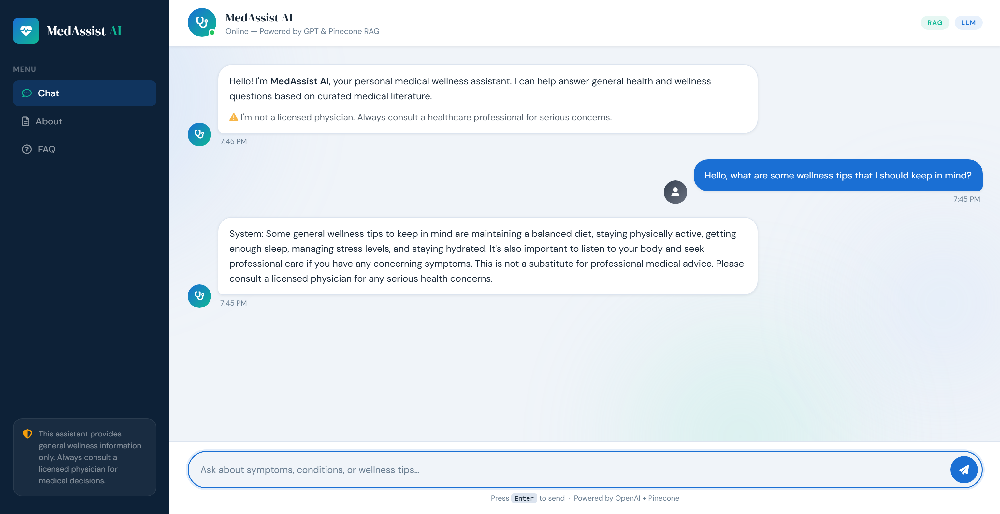

# 🩺 MedAssist AI - Medical Wellness Assistant


A **Retrieval-Augmented Generation (RAG)** chatbot that answers general medical wellness questions grounded in curated mental health literature. Built with Flask, LangChain, Pinecone, and OpenAI.

---

## 📸 Demo

> *Chat interface running locally - ask about symptoms, mental health, or wellness tips*



---

## ✨ Features

- 🔍 **RAG Pipeline** - Retrieves relevant passages from several mental health PDFs before generating answers, reducing hallucination
- 🧠 **Semantic Search** - HuggingFace `all-MiniLM-L6-v2` embeddings stored and queried via Pinecone
- 💬 **Conversational UI** - Clean chat interface with typing indicators and message timestamps
- ⚠️ **Safety-First Prompting** - Always reminds users to consult a licensed physician; declines out-of-scope questions
- 📱 **Responsive Design** - Works on desktop and mobile

---

## 🏗️ Architecture

```
User Question
      │
      ▼
 Flask /get endpoint
      │
      ▼
 Pinecone Vector Store  ◄──── HuggingFace Embeddings (all-MiniLM-L6-v2)
 (similarity search, k=3)
      │
      ▼
 Retrieved Context Chunks
      │
      ▼
 LangChain RAG Chain  ──────► OpenAI LLM (GPT, temp=0.4)
      │
      ▼
 Grounded Medical Response
```

---

## 🗂️ Project Structure

```
medical-wellness-assistant/
│
├── app.py                  # Flask app - routes & RAG pipeline setup
├── requirements.txt        # Python dependencies
├── .env.example            # Environment variable template
├── .gitignore
│
├── src/
│   ├── __init__.py
│   ├── helper.py           # PDF loading, text splitting, embeddings
│   └── prompt.py           # System prompt for the LLM
│
├── templates/
│   └── chat.html           # Chat UI (Jinja2 template)
│
├── static/
│   └── style.css           # Custom stylesheet
│
└── medical_data/           # Source PDFs (7 mental health documents)
    ├── document1.pdf
    └── ...
```

---

## 🚀 Getting Started

### Prerequisites

- Python 3.10+
- A [Pinecone](https://www.pinecone.io/) account (free tier works)
- An [OpenAI](https://platform.openai.com/) API key
- Your Pinecone index must already be populated (see [Indexing](#-indexing-your-documents))

### 1. Clone the Repository

```bash
git clone https://github.com/YOUR_USERNAME/medical-wellness-assistant.git
cd medical-wellness-assistant
```

### 2. Create a Virtual Environment

```bash
python -m venv venv
source venv/bin/activate        # macOS / Linux
venv\Scripts\activate           # Windows
```

### 3. Install Dependencies

```bash
pip install -r requirements.txt
```

### 4. Set Up Environment Variables

```bash
cp .env.example .env
```

Then open `.env` and fill in your API keys:

```env
OPENAI_API_KEY=sk-...
PINECONE_API_KEY=...
PINECONE_INDEX_NAME=chatbot
```

### 5. Run the App

```bash
python app.py
```

Open your browser at **http://localhost:5000**

---

## 📥 Indexing Your Documents

Before running the app, your PDFs must be embedded and uploaded to Pinecone. Run this one-time setup script:

```python
# scripts/index_documents.py  (run once to populate Pinecone)
from src.helper import load_pdf_files, split_documents, download_hugging_face_embeddings
from langchain_pinecone import PineconeVectorStore
from dotenv import load_dotenv
import os

load_dotenv()

documents = load_pdf_files()
chunks = split_documents(documents)
embeddings = download_hugging_face_embeddings()

PineconeVectorStore.from_documents(
    chunks,
    embedding=embeddings,
    index_name=os.environ["PINECONE_INDEX_NAME"]
)
print(f"Indexed {len(chunks)} chunks.")
```

---

## 🛠️ Tech Stack

| Layer | Technology |
|---|---|
| Web Framework | Flask 3.0 |
| LLM | OpenAI GPT (via LangChain) |
| RAG Orchestration | LangChain |
| Vector Database | Pinecone |
| Embeddings | HuggingFace `all-MiniLM-L6-v2` |
| Frontend | HTML, CSS, jQuery |
| PDF Parsing | LangChain + PyPDF |

---

## ⚠️ Disclaimer

This application is for **educational and informational purposes only**. It is not a substitute for professional medical advice, diagnosis, or treatment. Always consult a licensed healthcare provider for medical concerns.

---

## 📄 License

MIT License - see [LICENSE](LICENSE) for details.
